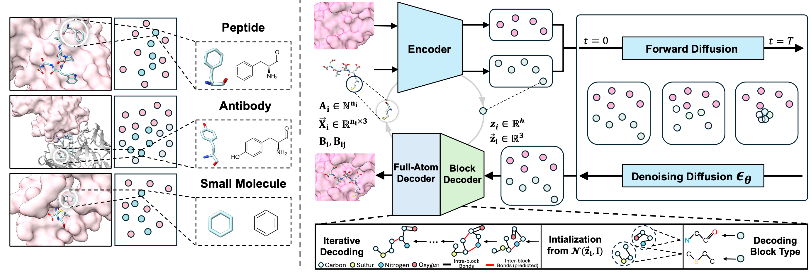

# UniMoMo: Unified Generative Modeling of 3D Molecules for *De Novo* Binder Design



## :dna: Introduction

This is the official repository for our paper [UniMoMo: Unified Generative Modeling of 3D Molecules for *De Novo* Binder Design](https://arxiv.org/pdf/2503.19300). We believe in one single all-atom generative models for designing all binders including small molecules, peptides, antibodies, and so on, since the physics underlying interactions and local geometries remain consistent. This is the starting point of the project which serves as a computational proof-of-concept. While the current form may still be a little bit simple for real-world applications, we are rigorously improving the framework through more data and functionalities. Thank you for your interest in our work!

## :mag: Quick Links

- [Setup](#rocket-setup)
  - [Environment](#environment)
  - [Trained Weights](#trained-weights)
- [Usage](#eyes-usage)
  - [Demo](#demo)
  - [Tutorials](#tutorials)
- [Reproduction of Paper Experiments](#page_facing_up-reproduction-of-paper-experiments)
  - [Additional Dependencies](#additional-dependencies)
  - [Datasets](#datasets)
  - [Training](#training)
  - [Inference](#inference)
  - [Evaluation](#evaluation)
- [Contact](#bulb-contact)
- [Reference](#reference)

## :rocket: Setup

### Environment

We have prepared conda environment configurations for **cuda 11.7 + pytorch 1.13.1** (`env_cuda117.yaml`) and **cuda 12.1 + pytorch 2.1.2** (`env_cuda121.yaml`). For example, you can create the environment by:

```bash
conda env create -f env_cuda117.yaml
```

Remember to activate the environment before running the codes:

```bash
conda activate UniMoMo
```

### Trained Weights

We have uploaded the trained checkpoint at the [release page](https://github.com/kxz18/UniMoMo/releases/tag/v1.0). Please download it and put it under `./checkpoints/model.ckpt`.

```bash
mkdir checkpoints
cd checkpoints
wget https://github.com/kxz18/UniMoMo/releases/download/v1.0/model.ckpt
```

## :eyes: Usage

### Demo

:bangbang: Before using the following codes, please first download the trained weights mentioned above.

**Small Molecule / Peptide / Antibody CDR Design**

We have prepared cleaned codes for inferencing on single or multiple target proteins of interest, which are located under `./api`. An example is provided at `./api/demo` which designs small molecule, peptide, and antibody binders to KRas G12C on the same binding site. You can directly run the example by:

```bash
python -m api.generate --config api/demo/config.yaml --ckpt checkpoints/model.ckpt --save_dir api/demo/generations --gpu 0
```

Then you will get the generated results at `./api/demo/generations`.

**Nanobody Design**

We have also provided a demo for Nanobody design with the config `./api/demo/nanobody_config.yaml`. In this case, we use Alphafold 3 to cofold KRas G12C and a nanobody h-NbBCII10 (PDB ID: 3EAK) to get a pseudo complex structure. The Alphafold 3 tends to memorize common binding sites on target proteins and docking orientations for nanobodies/antibodies, thus will produce seemingly reasonable complexes, which is enough as we only need the docked framework for CDR design. It is then renumber with Chothia system to get the input file `./api/demo/7mdp_3eak_chothia.pdb`. The antibody template is naturally compatible with nanobodies, therefore we can directly treat it as an antibody with only the heavy chain in the configuration and run:

```bash
python -m api.generate --config api/demo/nanobody_config.yaml --ckpt checkpoints/model.ckpt --save_dir api/demo/nanobody_generations --gpu 0
```


### Tutorials

Here we illustrate how we assembled the demo case, so that the users can customize configurations to run designs on their target of interest.

1. **Reference Binder.** Find a complex on PDB with a reference binder. Here we locate [**7mdp**](https://www.rcsb.org/structure/7MDP), which includes an antibody inhibitor to KRas G12C. This reference antibody helps the program to identify on which binding site the model should design binders.

2. **(Optional) Antibody Renumbering.** If you want to design antibodies, currently UniMoMo only supports designing CDRs on the antibody framework docked on the target proteins. The program relies on the Chothia numbering system to identify which parts on the antibody are CDRs, so the residue IDs in the given PDB file should be renumbered according to Chothia system. We have provided the toolkit in `./api/renumber.py`. With running the following command, the renumbered PDB file will be saved at `./api/demo/7mdp_chothia.pdb`:
   
   ```bash
   cd api
   python renumber.py demo/7mdp.pdb demo/7mdp_chothia.pdb chothia
   ```

3. **Configure.** Write a config clarifying the chain IDs of the target protein and the ligand, as well as the types and the numbers of binders to generate. Here we demonstrate the meaning of the config at `./api/demo/config.yaml`:
   
   ```yaml
   # contents of ./api/demo/config.yaml
   dataset:
     # Multiple references can be provided. You just need to add the corresponding information in a new line under each of pdb_paths, tgt_chains, and lig_chains.
     pdb_paths:
       - ./api/demo/7mdp_chothia.pdb   # Path to the reference complex.
     tgt_chains:
       - A     # The target proteins only include one chain, that is A.
     lig_chains:
       - HI    # The reference binder includes two chains, that is H and I. With antibody provided, the program assumes the heavy chain goes before the light chain, which means it will regard H as the heavy chain and I as the light chain in this case.
   
   templates:
     # Here we specify the type of binders we want to design
     - class: LinearPeptide    # Linear peptides with at lengths between 10 to 12, left inclusive and right exclusive.
       size_min: 10
       size_max: 12
     - class: Antibody     # Design HCDR3 on the given antigen-antibody complex. If multiple CDRs need to be designed, it is suggested to run designs sequentially, with one CDR designed each time.
       cdr_type: HCDR3
     - class: Molecule     # Small molecules. By default the number of blocks is sampled according to the spatial size of the binding site. You can also specify "size_min" and/or "size_max" to control the threshold of the sampled number of blocks.
   
   batch_size: 8   # Batch size. Adjust it according to your GPU memory available. Batch size = 8 can be run under 12G memory for most cases.
   n_samples: 20  # Number of generations. On each target provided, the model will generate 20 candidates for each template.
   ```

4. **Generation.** Finally, you can use the config to generate results via the following command, where `--config`, `--ckpt`, `--save_dir`, and `--gpu` specify the configuration, the checkpoint, the output directory, and the GPU to use, respectively:
   
   ```bash
   python -m api.generate --config api/demo/config.yaml --ckpt checkpoints/model.ckpt --save_dir api/demo/generations --gpu 0
   ```

### Molecule Partition CLI

We provide a lightweight command-line utility for experimenting with random molecular partitions at `scripts/chem/partition_demo.py`. It wraps the `random_subgraph_partition` helper and is primarily intended for inspecting how UniMoMo splits molecules into chemically meaningful building blocks before generation.

#### Features

* **Ring-aware partitioning.** Aromatic rings are treated as indivisible units: fused ring systems are never broken apart and always appear within the same partition. This guarantees that common motifs—such as benzene (`c1ccccc1`)—remain intact even when multiple fragments are requested.
* **Deterministic seeds.** Provide `--seed` to obtain reproducible partitions when debugging or preparing curated fragment libraries.
* **Fragment SMILES.** When `--show-smiles` is enabled (default), the CLI emits two fragment representations alongside the atom index partitions:
  * `fragments`: canonical RDKit fragment SMILES.
  * `fragments_with_attachment_points`: SMILES decorated with wildcard (`*`) atoms wherever a bond crosses a partition boundary, making attachment sites explicit for downstream assembly.

#### Interface and Usage

Run the script with a SMILES string and the desired number of partitions:

```bash
python scripts/chem/partition_demo.py "CCCC" --partitions 2 --seed 0
# {"partitions": [[0, 1], [2, 3]], "fragments": ["*CC", "*CC"], "fragments_with_attachment_points": ["*CC", "*CC"]}
```

The JSON payload always includes the `partitions` field; the SMILES fields can be suppressed via `--no-show-smiles` if only atom indices are required:

```bash
python scripts/chem/partition_demo.py "c1ccccc1" --partitions 3 --seed 13 --no-show-smiles
# {"partitions": [[0, 5], [1], [2, 3, 4]]}
```

Partition requests are validated to respect ring integrity. If the requested number of partitions exceeds the available combination of fused ring systems and non-ring atoms, an error is raised instead of slicing a ring apart:

```bash
python scripts/chem/partition_demo.py "Cc1ccccc1" --partitions 3 --seed 2
# num_partitions cannot exceed the number of ring systems plus non-ring atoms

python scripts/chem/partition_demo.py "Cc1ccccc1" --partitions 2 --seed 2
# {"partitions": [[0], [1, 2, 3, 4, 5, 6]], "fragments": ["*C", "*c1ccccc1"], "fragments_with_attachment_points": ["C*", "*c1ccccc1*"]}
```

## :page_facing_up: Reproduction of Paper Experiments

### Additional Dependencies

#### PyRosetta

PyRosetta is used to calculate interface energy of generated peptides and antibody CDRs. Please follow the official instruction [here](https://www.pyrosetta.org/downloads) to install it.

#### CBGBench

CBGBench is used to evaluate designed small molecules comprehensively. Please follow its [official repository](https://github.com/EDAPINENUT/CBGBench) to prepare the codes and environment. We recommend building another environment specifically for CBGBench to separate the dependencies from the environment of UniMoMo.

### Datasets

**Throughout the instructions, we suppose all the datasets are downloaded below `./datasets`.**

#### 1. Peptide

Suppose all data are saved under `./datasets/peptide`. We set environment variable `export PREFIX=./datasets/peptide`. The data for peptides includes the following datasets:

- LNR: The test set of 93 complexes.
- PepBench: The training/validation dataset of about 6K complexes with the peptide length between 4 to 25.
- ProtFrag: Augmented dataset with about 70K pseudo pocket-peptide complexes from local contexts of protein monomers.

Download:

```bash
# create the folder
mkdir -p $PREFIX
# LNR
wget https://zenodo.org/records/13373108/files/LNR.tar.gz?download=1 -O ${PREFIX}/LNR.tar.gz
tar zxvf ${PREFIX}/LNR.tar.gz -C $PREFIX
# PepBench
wget https://zenodo.org/records/13373108/files/train_valid.tar.gz?download=1 -O ${PREFIX}/pepbench.tar.gz
tar zxvf $PREFIX/pepbench.tar.gz -C $PREFIX
mv ${PREFIX}/train_valid ${PREFIX}/pepbench
# ProtFrag
wget https://zenodo.org/records/13373108/files/ProtFrag.tar.gz?download=1 -O ${PREFIX}/ProtFrag.tar.gz
tar zxvf $PREFIX/ProtFrag.tar.gz -C $PREFIX
```

Processing:

```bash
python -m scripts.data_process.peptide.pepbench --index ${PREFIX}/LNR/test.txt --out_dir ${PREFIX}/LNR/processed --remove_het
python -m scripts.data_process.peptide.pepbench --index ${PREFIX}/pepbench/all.txt --out_dir ${PREFIX}/pepbench/processed
python -m scripts.data_process.peptide.transform_index --train_index ${PREFIX}/pepbench/train.txt --valid_index ${PREFIX}/pepbench/valid.txt --all_index_for_non_standard ${PREFIX}/pepbench/all.txt --processed_dir ${PREFIX}/pepbench/processed/
python -m scripts.data_process.peptide.pepbench --index ${PREFIX}/ProtFrag/all.txt --out_dir ${PREFIX}/ProtFrag/processed
```

#### 2. Antibody

Suppose all data are saved under `./datasets/antibody`. We set environment variable `export PREFIX=./datasets/antibody`. We use SAbDab downloaded at **Sep 24th, 2024** for training, validation, and testing on antibody CDR design, with testing complexes coming from RAbD. As the database is weekly updated, we have also uploaded the processed binary files and index files on [google drive](https://drive.google.com/file/d/1N5Y46B0CBDQ4fOxkiMCuyPz3yPdDYVG-/view?usp=sharing) for reproduction and benchmarking purposes. We also provide the IDs of the complexes used in our paper under `./datasets/antibody`(train/valid/test_id.txt), so that users can use these IDs to filter the downloaded SAbDab database to reconstruct the splits used in our paper.

Download with the newest updates:

```bash
mkdir -p ${PREFIX}/SAbDab
# download the summary file
wget https://opig.stats.ox.ac.uk/webapps/sabdab-sabpred/sabdab/summary/all/ -O ${PREFIX}/SAbDab/summary.csv
# download the structure data
wget https://opig.stats.ox.ac.uk/webapps/newsabdab/sabdab/archive/all/ -O ${PREFIX}/SAbDab/all_structures.zip
# decompress the zip file
unzip $PREFIX/SAbDab/all_structures.zip -d $PREFIX/SAbDab/
```

Processing:

```bash
# process
python -m scripts.data_process.antibody.sabdab --index ${PREFIX}/SAbDab/summary.csv --out_dir ${PREFIX}/SAbDab/processed
# split by target protein sequence identity (40%)
# if you want to reconstruct the benchmark used in our paper, please manually generate the index files with the splits provided under ./datasets/antibody 
python -m scripts.data_process.antibody.split --index ${PREFIX}/SAbDab/processed/index.txt --rabd_summary ${PREFIX}/RAbD/rabd_summary.jsonl
```

#### 3. Small Molecule

Suppose all data are saved under `./datasets/molecule`. We set environment variable `export PREFIX=./datasets/molecule`. We use CrossedDocked dataset for training and testing on the task of small molecule design. Please refer to the [paper](https://github.com/luost26/3D-Generative-SBDD/blob/main/data/README.md) for the construction of the ML benchmark on CrossDocked2020, which provides the compressed file and its split on the [google drive](https://drive.google.com/drive/folders/1CzwxmTpjbrt83z_wBzcQncq84OVDPurM). The original split only include the training and the test sets. Therefore, we additionally separate the last 100 complexes from the training set for validation.

Suppose the two files are already downloaded:

- Compressed data at `${PREFIX}/CrossDocked/crossdocked_pocket10.tar.gz`
- Split file at `${PREFIX}/CrossDocked/split_by_name.pt`

```bash
mkdir -p ${PREFIX}/CrossDocked
tar zxvf ${PREFIX}/CrossDocked/crossdocked_pocket10.tar.gz -C ${PREFIX}/CrossDocked
```

Processing:

```bash
python -m scripts.data_process.molecule.crossdocked --split ${PREFIX}/CrossDocked/split_by_name.pt --data_dir ${PREFIX}/CrossDocked/crossdocked_pocket10 --out_dir ${PREFIX}/CrossDocked/processed
```

### Training

Training of the full UniMoMo requires 8 GPUs with 80G memmory each. The process includes training an all-atom variational encoder, and a block-level latent diffusion model, which commonly takes about 2-3 days. We also enable TF32 by setting the environment variable `TORCH_ALLOW_TF32_CUBLAS_OVERRIDE=1` for accelerated training and optimized GPU memory usage.

```bash
GPU=0,1,2,3,4,5,6,7 bash scripts/train_pipe.sh ./ckpts/unimomo ./configs/IterAE/train.yaml ./configs/LDM/train.yaml
```

**Dynamic fragment thresholds & logging.** Retrieval-aware runs (e.g. `configs/IterAE/train_rag_dynamic_mol.yaml`) now accept staged heavy-atom thresholds through `min_heavy_atoms`. You can provide a list such as `[8, 4]`; the wrapper first keeps fragments with ≥8 heavy atoms, and if that would drop all fragments it relaxes to ≥4. The sampler still honours `storage_min_heavy_atoms` (default `8`) when writing JSONLs so the fragment index only stores sizeable substructures. When `zero_detail_log` is set, every time the RAG contrastive loss observes zero positives the model appends a JSON line describing the sample, available fragments and diagnostic flags to the specified file. Setting `success_detail_log` mirrors this for successful batches so you can sanity-check which samples still yield positives. Retrieval will first draw in-batch negatives, then exclude-aware index samples, and finally fall back to global fragments so peptides can borrow small-molecule negatives if needed.

**Summary-based source SMILES.** `RAGBatchWrapper` now falls back to the underlying dataset summaries when neither `rag_map_path` nor `dynamic_partition` is provided. The wrapper validates that `get_summary(idx).ref_seq` can be parsed as a SMILES (true for `MoleculeDataset`/`DynamicBlockWrapper` outputs) before using it, so peptide samples whose summaries contain amino-acid sequences remain unaffected. This lets you rely on a single `DynamicBlockWrapper` for dynamic fragment generation and JSONL storage, eliminating redundant RDKit work.

**Validation without disk writes.** When you only need fragments during training, drop the `storage_path`/`log_path` fields from validation or test splits. With the summary fallback in place, evaluation loaders can operate without emitting fragment JSONLs or logs, which keeps validation runs read-only.

**Inspecting fragment coverage.** Two utility scripts help troubleshoot the availability of positive fragments:

```bash
# sanity-check dynamic partitions on a dataset slice
python scripts/analysis/check_dynamic_partitions.py \
  --config configs/IterAE/train_rag_dynamic_mol.yaml \
  --split train --index 1 --limit 200 \
  --dump-fragments ./logs/partition_fragments.json

# summarise zero-positive batches during/after training
python scripts/analysis/report_rag_zero.py \
  --zero-log ./logs/rag_zero_positive.jsonl \
  --fragments ./datasets/molecule/CrossDocked/subgraphs.dynamic.jsonl \
  --output ./logs/rag_zero_positive_report.json
```

The first command reports per-sample fragment counts after filtering; the second correlates RAG zero-positive logs with the fragment store to reveal which SMILES were skipped by the contrastive loss.

### Inference

The following commands generate 100 candidates for each target in the test sets, which are LNR, RAbD, and CrossDocked test set for peptide, antibody, and small molecule, respectively.

```bash
# peptide
python generate.py --config configs/test/test_pep.yaml --ckpt /path/to/checkpoint.ckpt --gpu 0 --save_dir ./results/pep
# antibody
python generate.py --config configs/test/test_ab.yaml --ckpt /path/to/checkpoint.ckpt --gpu 0 --save_dir ./results/ab
# small molecule
python generate.py --config configs/test/test_mol.yaml --ckpt /path/to/checkpoint.ckpt --gpu 0 --save_dir ./results/mol
```

### Retrieval-aware training

- Decoder block embeddings (`block_h`) are now aligned with fragment encodings: `rag_contrastive_loss` operates on these embeddings and uses dynamic fragments when available.
- The same embeddings drive nearest-neighbour retrieval. When `retrieval_loss` observes valid positives the block-type classifier is automatically zeroed, otherwise it falls back to cross-entropy supervision.
- Retrieval defaults to in-batch negatives; additional fragments can still be appended through `FragmentIndex` and dynamic partition JSONLs.
- Cross-modal negatives: set `model.rag_opt.cross_modal_index` to a peptide fragment JSONL (e.g. `datasets/peptide/subgraphs_residue.train.jsonl`) and tune `cross_modal_neg_ratio` (0-1). When enabled, each InfoNCE batch blends molecule fragments with peptide residues and the reverse pairing for peptides.

### Evaluation

:question: Due to the non-deterministic behavior of `torch.scatter`, the reproduced results might not be exactly the same as those reported in the paper, but should be very close to them.

Please revise the path to CBGBench and CrossDocked2020 in `./scripts/metrics/mol.sh`:

```bash
# Line 5 and line 6 in ./scripts/metrics/mol.sh
CBGBENCH_REPO=/path/to/CBGBench
DATA_DIR=/path/to/CrossDocked/crossdocked_pocket10
```

The evaluation scripts are as follows. Note that the evaluation process is CPU-intensive. During our experiments, each of them requires running for several hours on 96 cpu cores.

```bash
# peptide
python -m scripts.metrics.peptide --results ./results/pep/results.jsonl --num_workers 96
# antibody
python -m scripts.metrics.peptide --results ./results/ab/results.jsonl --antibody --log_suffix HCDR3 --num_workers 96
# small molecule
conda activate cbgbench # use its own environment
bash scripts/metrics/mol.sh ./results/mol/candidates
```

## :bulb: Contact

Thank you for your interest in our work!

Please feel free to ask about any questions about the algorithms, codes, as well as problems encountered in running them so that we can make it clearer and better. You can either create an issue in the github repo or contact us at jackie_kxz@outlook.com.

## Reference

```bibtex
@inproceedings{
    kong2025unimomo,
    title={UniMoMo: Unified Generative Modeling of 3D Molecules for De Novo Binder Design},
    author={Kong, Xiangzhe and Zhang, Zishen and Zhang, Ziting and Jiao, Rui and Ma, Jianzhu and Liu, Kai and Huang, Wenbing and Liu, Yang},
    booktitle={Forty-second International Conference on Machine Learning},
    year={2025}
}
```
